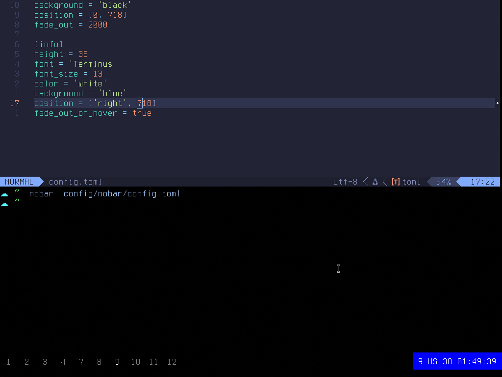

A sleek PyQt6 widget system, designed to replace the toolbar - for use with i3wm.



## Installation

1. Clone the project to your home directory:
   ```bash
   cd ~
   git clone https://github.com/microdot178/.nobar.git
   cd nobar
   ```

2. Run the installation script:
   ```bash
   ./install.sh
   ```

The installation script will:
- Set up configuration directory at `~/.config/nobar/`
- Create executable file at `~/.local/bin/nobar`
- Create Python virtual environment at `~/.virtualenvs/nobar/`
- Install Python dependencies in the virtual environment

## Configuration

| Parameter           | Description                                                                                 | Widget | Value               |
| ------------------- | ------------------------------------------------------------------------------------------- | ------ | ------------------- |
| `height`            | Sets the height of the widget.                                                              | all    | int                 |
| `font`              | Sets the font of the widget.                                                                | all    | string              |
| `font_size`         | Sets the font size of the widget.                                                           | all    | int                 |
| `color`             | Sets the text color of the widget.                                                          | all    | string, hex, or RGB |
| `background`        | Sets the background color of the widget.                                                    | all    | string, hex, or RGB |
| `position`          | Sets the position of the widget on the screen.                                              | all    | [x, y]              |
|                     |                                                                                             |        | x: int or 'right'   |
|                     |                                                                                             |        | y: int or 'bottom'  |
| `fade_out`          | Sets the time after which the widget disappears when not interacted with (in milliseconds). | all    | int                 |
| `fade_out_on_hover` | Sets whether the widget disappears when hovered over.                                       | all    | boolean             |
