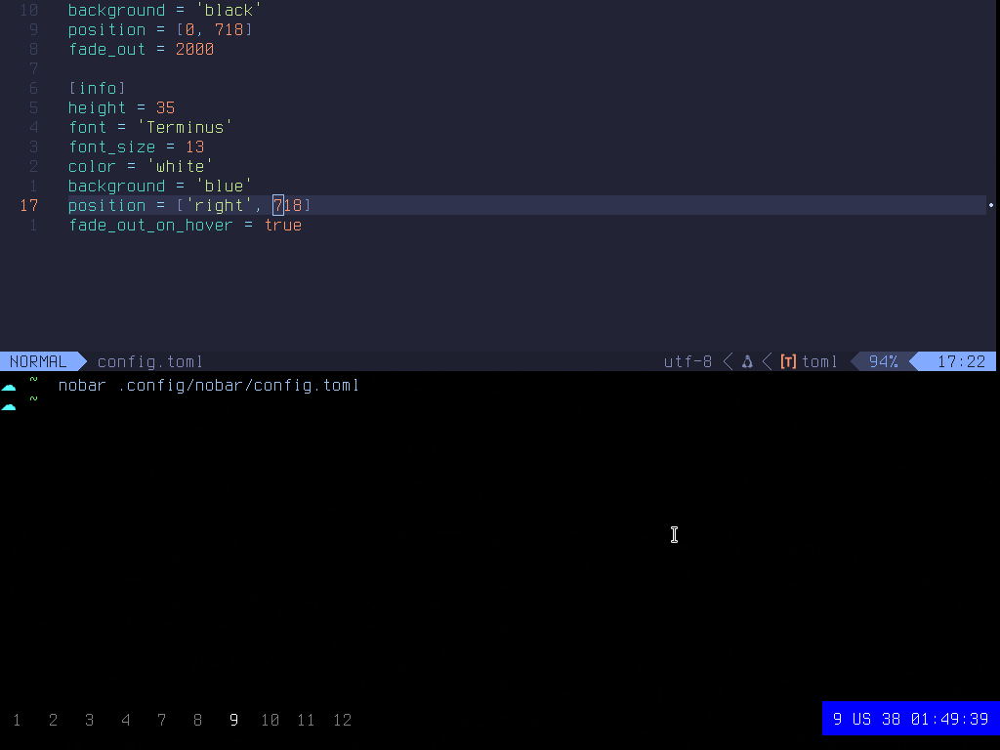

# .nobar

A PyQt6 widget system, designed to replace the toolbar — for use with i3wm.



## Installation

1. Clone the project to your home directory:

   ```bash
   cd ~
   git clone https://github.com/microdot178/.nobar.git
   cd .nobar
   ```

2. Run the installation script:

   ```bash
   ./install.sh
   ```

The installation script will:

- Set up configuration directory at `~/.config/nobar/`
- Create executable file at `~/.local/bin/nobar`
- Create i3 command wrapper at `~/.local/bin/nobar_command`
- Create Python virtual environment at `~/.virtualenvs/nobar/`
- Install Python dependencies in the virtual environment

## Usage

```bash
# Run with default config
nobar

# Run with specific widgets
nobar --widgets workspaces info

# Send commands to widgets via i3 IPC
nobar_command <widget> <method>
```

Binding commands in i3 config:

```bash
bindsym $mod+i exec nobar_command info hide
bindsym $mod+Shift+i exec nobar_command info show
```

## Configuration

Config file: `~/.config/nobar/config.toml`

### Parameters

| Parameter           | Description                           | Value                                    |
| ------------------- | ------------------------------------- | ---------------------------------------- |
| `height`            | Widget height in pixels               | `int`                                    |
| `font`              | Font family                           | `string`                                 |
| `font_size`         | Font size in points                   | `int`                                    |
| `color`             | Text color                            | `string`, `hex`, or `RGB`                |
| `focused`           | Focused workspace text color          | `string`, `hex`, or `RGB`                |
| `background`        | Background color                      | `string`, `hex`, or `RGB`                |
| `position`          | Position on screen                    | `[x, y]` — `int` or `'right'`/`'bottom'` |
| `screen`            | Screen index for multi-monitor setups | `int`                                    |
| `fade_out`          | Auto-hide delay in milliseconds       | `int`                                    |
| `fade_out_on_hover` | Hide widget on mouse hover            | `bool`                                   |

